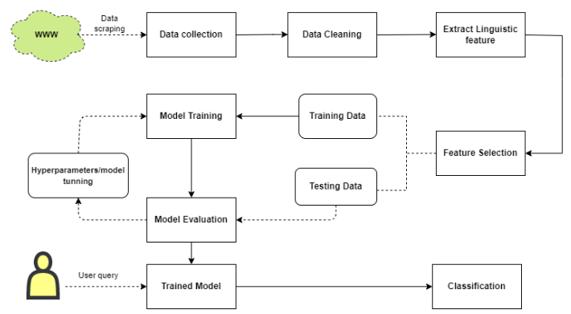
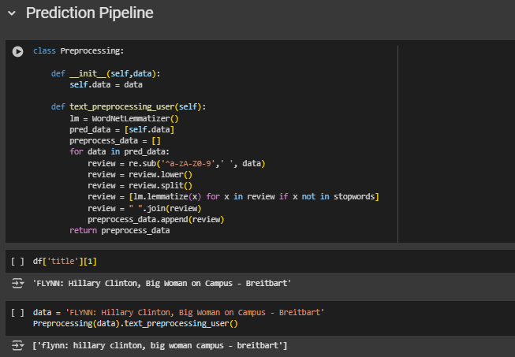
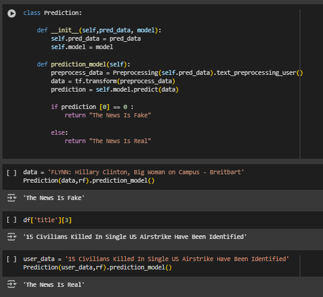
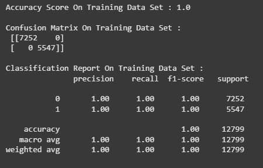
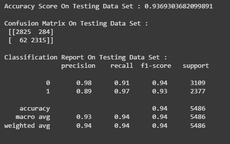

# TruthLens:AI Powered Fake News Detection
## About:
The proliferation of information on the internet has led to an increase in the circulation of both authentic and fake news. Fake news can mislead readers, manipulate opinions, and cause societal harm. Identifying fake news can be a challenging task, especially for users who are not trained in media literacy. The goal of this project is to use Natural Language Processing (NLP) techniques to automatically classify news articles into "real" or "fake" categories, improving the efficiency and accuracy of news verification.

The project focuses on developing a machine learning model that can process and analyze textual content from news articles, extract meaningful patterns, and use them to distinguish between real and fake news. By using state-of-the-art NLP techniques such as text pre-processing, tokenization, feature extraction, and machine learning algorithms, we aim to create an efficient fake news detection system.

## Features:
News Data Collection: The model will be trained on labeled datasets containing both real and fake news articles from multiple sources.

Text Pre-processing: The project uses NLP techniques like tokenization, stemming, lemmatization, stop-word removal, and text normalization to clean and prepare the dataset.

Feature Extraction: The system will extract relevant features from the articles, such as bag-of-words, n-grams, sentiment analysis, and TF-IDF (Term Frequency-Inverse Document Frequency).

Model Training: The model will be trained using machine learning algorithms like Logistic Regression, Decision Trees, Naive Bayes, and Random Forest, among others.

Model Evaluation: The model's performance will be evaluated using metrics such as accuracy, precision, recall, F1-score, and confusion matrix.

Real-Time Classification: Once the model is trained, it will be able to classify new, unseen news articles as real or fake in real-time.

Visualization: Data visualization will be used to represent the distribution of real vs fake news and evaluate model performance through graphs and charts.

## Requirements:
### Software Requirements:
Python 3.x
### Libraries:
pandas (for data manipulation)

numpy (for numerical computations)

scikit-learn (for machine learning algorithms)

nltk/spacy (for NLP tasks)

matplotlib & seaborn (for visualization)

TensorFlow or PyTorch (optional, if using deep learning models)

regex (for text cleaning and processing)

### Hardware Requirements:
A machine with at least 8 GB RAM and 4 CPU cores for smooth processing.

A stable internet connection to gather datasets from online sources if necessary.

## System Architecture:

## Prediction Output:

## Accuracy:

## Results:
The results of the fake news classification model will be evaluated based on several metrics:

Accuracy: Measures the overall correctness of the model.

Precision: The fraction of relevant instances among the retrieved instances (i.e., the percentage of correctly predicted fake news articles).

Recall: The fraction of relevant instances that have been retrieved (i.e., the model’s ability to detect all fake news articles).

F1-Score: The harmonic mean of precision and recall, providing a balance between the two.

Confusion Matrix: A table used to describe the performance of the classification model in terms of true positives, true negatives, false positives, and false negatives.

## Impact:
Combating Misinformation: By using this model, users can quickly detect fake news and prevent the spread of misinformation.

Promoting Trust: The model can help restore trust in online news platforms by providing users with a way to easily verify the authenticity of news articles.

Boosting Media Literacy: This tool can also serve as an educational platform, helping users understand the markers of fake news and improving media literacy.

Efficiency: Automating the process of fake news detection saves time and effort compared to manual verification.

Scalability: The model can be scaled to analyze massive datasets and could be deployed in real-time applications such as social media platforms, news websites, or browser extensions.

## References
[1]         Shlok Gilda, “Evaluating machine learning algorithms for fake news detection, ” Wilayah Persekutuan Putrajaya, Malaysia, 2017 IEEE 15th Student conference on research and development (SCOReD)

[2]         M. F. Mridha, Ashfia Jannat Keya, Md. Abdul Hamid, “A Comprehensive Review on Fake News Detection With Deep Learning,” 2019 

[3]       H. Allcott and M. Gentzkow, "Social media and fake news in the 2016 election", J. Econ. Perspect., vol. 31, no. 2, pp. 36-211, 2017.

[4]	T. Rasool, W. H. Butt, A. Shaukat and M. U. Akram, "Multi-label fake news detection using multi-layered supervised learning", Proc. 11th Int. Conf. Comput. Autom. Eng., pp. 73-77, 2019.

[5]	X. Zhang and A. A. Ghorbani, "An overview of online fake news: Characterization detection and discussion", Inf. Process. Manage., vol. 57, no. 2, Mar. 2020.

[6]	Abdullah-All-Tanvir, E. M. Mahir, S. Akhter and M. R. Huq, "Detecting fake news using machine learning and deep learning algorithms", Proc. 7th Int. Conf. Smart Comput. Commun. (ICSCC), pp. 1-5, Jun. 2019.

[7]	K. Shu, A. Sliva, S. Wang, J. Tang and H. Liu, "Fake news detection on social media: A data mining perspective", ACM SIGKDD Explorations Newslett., vol. 19, no. 1, pp. 22-36, 2017.

[8]       R. Oshikawa, J. Qian and W. Y. Wang, "A survey on natural language processing for fake news detection", arXiv:1811.00770, 2018. 

[9]       S. B. Parikh and P. K. Atrey, "Media-rich fake news detection: A survey", Proc. IEEE Conf. Multimedia Inf. Process. Retr. (MIPR), pp. 436-441, Apr. 2018.

[10]     A. Habib, M. Z. Asghar, A. Khan, A. Habib and A. Khan, "False information detection in online content and its role in decision making: A systematic literature review", Social Netw. Anal. Mining, vol. 9, no. 1, pp. 1-20, Dec. 2019.

[11]   M. K. Elhadad, K. F. Li and F. Gebali, "Fake news detection on social media: A systematic survey", Proc. IEEE Pacific Rim Conf. Commun. Comput. Signal Process. (PACRIM), pp. 1-8, Aug. 2019.

[12]    A. Bondielli and F. Marcelloni, "A survey on fake news and rumour detection techniques", Inf. Sci., vol. 497, pp. 38-55, Sep. 2019.

[13]     P. Meel and D. K. Vishwakarma, "Fake news rumor information pollution in social media and web: A contemporary survey of state-of-the-arts challenges and opportunities", Expert Syst. Appl., vol. 153, Sep. 2020.

[14]    K. Sharma, F. Qian, H. Jiang, N. Ruchansky, M. Zhang and Y. Liu, "Combating fake news: A survey on identification and mitigation techniques", ACM Trans. Intell. Syst. Technol., vol. 10, no. 3, pp. 1-42, May 2019.

[15]  X. Zhou and R. Zafarani, "A survey of fake news: Fundamental theories detection methods and opportunities", ACM Comput. Surv., vol. 53, no. 5, pp. 1-40, 2020.

[16]   B. Collins, D. T. Hoang, N. T. Nguyen and D. Hwang, "Trends in combating fake news on social media—A survey", J. Inf. Telecommun., vol. 5, no. 2, pp. 247-266, 2021.

[17]    A. Zubiaga, A. Aker, K. Bontcheva, M. Liakata and R. Procter, "Detection and resolution of rumours in social media: A survey", ACM Comput. Surveys, vol. 51, no. 2, pp. 1-36, Jun. 2018.

[18]   H. Ahmed, I. Traore and S. Saad, "Detecting opinion spams and fake news using text classification", Secur. Privacy, vol. 1, no. 1, pp. e9, Jan. 2018.

[19]  H. Ahmed, I. Traore and S. Saad, "Detection of online fake news using N-gram analysis and machine learning techniques", Proc. Int. Conf. Intell. Secure Dependable Syst. Distrib. Cloud Environ., pp. 127-138, 2017.

[20]  B. Bhutani, N. Rastogi, P. Sehgal and A. Purwar, "Fake news detection using sentiment analysis", Proc. 12th Int. Conf. Contemp. Comput. (IC), pp. 1-5, Aug. 2019.
